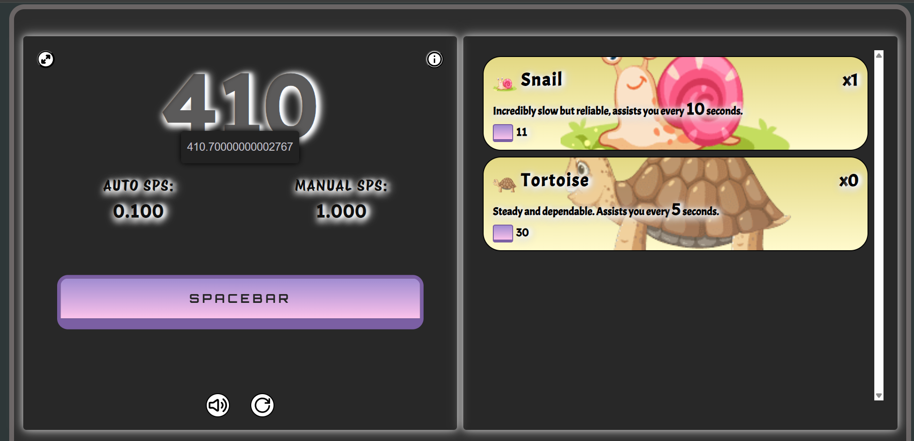

<h1 align= "center";> 🚀 Spacebar Clicker </h1>  

**Spacebar Clicker** is a **web-based game** that challenges how quickly and how many times you can click the **spacebar key** within a **determined time limit**.  
It's a **straightforward** yet **highly interactive tool** that tests your **clicking** or **tapping speed**.  

The idea is simple — once you **initiate the timer**, you aim to **hit the spacebar** as fast as possible before the **countdown** runs out.  
When the time expires, your **total clicks** and **average clicks per second (CPS)** are revealed instantly.  

This is a **favorite among gamers**, **typists**, and **competitive players** who wish to improve their **hand–eye coordination**, **reflexes**, and **reaction time**.  
**Spacebar Clicker** runs smoothly on all devices — whether a **laptop**, **desktop**, or **tablet**.  

It also serves as a **stress-relieving activity** or a fun **break from work**.  
You can play for **a few seconds** or for **extended periods** — the more you play, the **faster and sharper** you become!  

In all, **Spacebar Clicker** is more than just a tool — it's a **fun and simple game** to practice your **focus**, **speed**, and **consistency**.  
Whether you use it for **enjoyment** or **self-improvement**, each click is a step toward becoming a **master of reflexes**.💥  

## 🎮 Features  

- 🖱️ **Unlimited Clicking** — keep pressing the spacebar with **no time limit!**  
- 💰 **Upgrade System** — purchase upgrades and items to **increase your click count** and earn faster.  
- 🔊 **Satisfying Sound Effects** — enjoy smooth and responsive sounds with every click.  
- 🧩 **Smooth Animations** — clean transitions and responsive design for seamless gameplay.  
- 🎨 **Modern, Minimal Interface** — simple yet visually appealing layout.  
- 🕹️ **Simple Gameplay** — easy to start, addictive to continue!  
- 💻 **Device Compatibility** — runs smoothly on laptops, desktops, and tablets.  
- 🚫 **No Signup Needed** — jump straight into the game without registration.  
- 📈 **Progress Tracker** — monitor your growth and coin earnings as you upgrade.  
- 😌 **Stress Relief** — relaxing and satisfying way to unwind anytime.  
- 🏆 **Challenge Friends** — compete for fun and clicking glory!  
- 💰 **Free to Play** — completely free, no hidden charges or ads.   

## 🧠 How to Play  

1. Start the game — no timers, no limits!  
2. Press the **spacebar** repeatedly to Increase count.  
3. Use your count to **purchase items** or **new features**    
4. Keep clicking and building your counts — the more you click, the more you grow!  

## 🛠️ Built With  

- **HTML5** – For layout and structure  
- **CSS3** – For styling and effects  
- **JavaScript (ES6)** – For core game logic and shop system  
- **Sound Effects** – For an engaging experience  

## 🏆 Future Updates  

- 🏪 Update More items   
- 🌈 Visual effects for purchases  
- 💾 Auto-save progress  
- 📱 Mobile-friendly layout  

## 📸 Preview  

## 💖 Contribute

Got ideas for new features or improvements?  
Open an **issue** or create a **pull request** — contributions are always welcome!  

